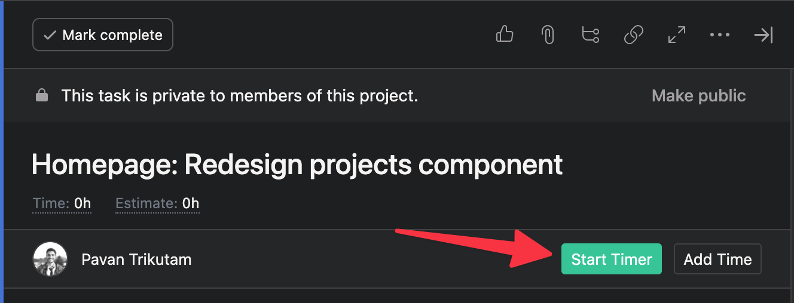

## Project management

All of our work is managed with Asana. For each client, we will have a different [team](https://help.asana.com/s/article/team-basics?language=en_US), and within that team we may have multiple projects for each client.

Being that we're a consultancy, it's not uncommon for our team to be working on multiple projects at the same time. We try to batch together the work to minimize context switching, but sometimes it is unavoidable. This requires staying organized to ensure that we don't lose track of what we're supposed to work on.

Here is how we manage that:

- **Work asynchronously.** Our work is intended to be asynchronous as much as possible. In general, try to keep as much context and historical information within the tickets you are working on. If decisions or discussion happen outside of tickets, be sure to update the tickets with the information that was discussed. See [our communication guidelines](https://github.com/graybike/handbook/blob/master/communication.md) for more tips on communicating asynchronously.

- **Assign a ticket to someone else if you need a response or action from them.** Simply tagging someone in the comments can get lost, but if you explicitly assign the ticket to them, they’ll know the next step is on them. Then, when they’re done with their next step, they can assign it back to you and you can pick the ticket back up.

- **When submitting a ticket for review, always include the PR and QA link.** This way, when you’re assigning it to someone else for reviewing, they don’t have to go searching somewhere else on how to find your work.
	- Link PRs / Issues together in Github if you’re using that as a project management tool.
	- For other tools, like Trello or Asana, drop the PR & QA links into a comment.

- **Check your priority queue.** Since we work with more than one client at a time, priorities can change from day to day. New requests come up and emergencies happen. The primary way we manage priorities is by ordering tickets on your "My Tasks" page. You will start each day by checking what's at the top of your priority queue and pick a ticket from there.

### Time tracking

We use [Everhour](https://everhour.com/) to track our time. You will receive an invite to Everhour as part of your onboarding.

Once you've set up your Everhour account, you should install [the Everhour time tracking extension](https://everhour.com/extensions) in your browser of choice. Once installed, you can track time directly within the tasks that you are working on:

Every time you begin work on a ticket, be sure to start your timer or manually add your hours. This enables us to run reports, track budgets, and ensure we are billing our clients (and paying you) appropriately.
